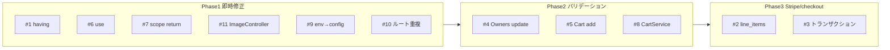

# umarche コードレビュー指摘 修正プラン

資料「umarche_review_v2_final.docx」の **指摘事項（全11件）** を、1つずつ確実に直すための手順です。  
次期実践課題（課題1〜5）は別フェーズとして、本プランでは **指摘 #1〜#11 の修正** に絞ります。

---

## 修正の進め方（推奨順）

依存関係とリスクを考慮し、**単純な修正 → バリデーション・ロジック → Stripe/checkout** の順で進めます。

---

## Phase 1：即時修正（単一ファイル・影響範囲が小さい）

### 指摘 #1：在庫表示の having 条件ミス（Critical）

- **対象**: [app/Models/Product.php](app/Models/Product.php) の `scopeAvailableItems`
- **現状**: 78行目 `->having('quantity', '>', 1)` のため、在庫1個の商品が一覧から消える
- **修正**: `1` を `0` に変更（在庫が1以上なら表示）
- **確認**: 在庫1個の商品が商品一覧に表示されること

---

### 指摘 #6：Throwable / Log の use 漏れ（Warning）

- **対象**: [app/Http/Controllers/Owner/ProductController.php](app/Http/Controllers/Owner/ProductController.php)
- **現状**: `store()` / `update()` の catch で `Throwable` と `Log::error()` を使用しているが use なし
- **修正**: ファイル先頭に以下を追加  
`use Throwable;`  
`use Illuminate\Support\Facades\Log;`
- **確認**: 商品登録・更新のエラー時に Fatal にならずログが出力されること

---

### 指摘 #7：スコープの return 不備（Warning）

- **対象**: [app/Models/Product.php](app/Models/Product.php)
- **修正内容**:
  1. **scopeSelectCategory**（115〜123行付近）: `} else { return; }` を `} else { return $query; }` に変更
  2. **scopeSearchKeyword**（125〜146行付近）: `} else { return; }` を `} else { return $query; }` に変更
  3. **scopeSortOrder**（96〜113行付近）: 各 if の後の return はそのまま、**関数末尾（112行付近の `}` の前）に `return $query;` を追加**（想定外の `$sortOrder` でもチェーンが切れないようにする）
- **確認**: 商品一覧のカテゴリ・キーワード・ソートでエラーが出ないこと

---

### 指摘 #11：ImageController の二重クエリと Collection 判定（Notice）

- **対象**: [app/Http/Controllers/Owner/ImageController.php](app/Http/Controllers/Owner/ImageController.php) の `destroy()`
- **修正内容**:
  1. 139行目: `Image::findOrFail($id)->delete();` を **取得済みの `$image` を使って** `$image->delete();` に変更（二重クエリ解消）
  2. 113行目: `if($imageInProducts)` を `if($imageInProducts->isNotEmpty())` に変更（空コレクションでも意図通り動作）
- **確認**: 画像削除がエラーなく完了し、商品に紐付いていない画像のみ削除した場合も問題ないこと

---

### 指摘 #9：env() の直接使用（Notice）

- **対象**: [app/Http/Controllers/User/CartController.php](app/Http/Controllers/User/CartController.php) の `checkout()`、および [config/services.php](config/services.php)
- **修正内容**:
  1. **config/services.php**: 既存の `return [` 内に Stripe 設定を追加
    `'stripe' => [ 'secret' => env('STRIPE_SECRET_KEY'), 'public' => env('STRIPE_PUBLIC_KEY'), ],`
  2. **CartController**:
    - `env('STRIPE_SECRET_KEY')` → `config('services.stripe.secret')`  
    - `env('STRIPE_PUBLIC_KEY')` → `config('services.stripe.public')`
- **確認**: `php artisan config:cache` 後も決済画面が表示されること（.env は config 経由でのみ参照）

---

### 指摘 #10：'/' ルートの重複定義（Notice）

- **対象**: [routes/web.php](routes/web.php)
- **現状**: 20行目で `Route::get('/', ...)` が welcome、25行目で auth グループ内でも `Route::get('/', ...)` が ItemController::index。上からマッチするため認証済みユーザーが `/` にアクセスしても常に welcome になる
- **修正方針（どちらか1つ）**:
  - **A**: 20行目のクロージャ内で、認証済みなら `redirect()->route('user.items.index')`、未認証なら `view('user.welcome')` を返す（`Auth::check()` 使用）
  - **B**: auth グループ内の `Route::get('/', ...)` を `Route::get('/items', ...)` に変更し、ルート名は `items.index` のまま。その場合、`RouteServiceProvider::HOME` が `/` のままだとログイン後は welcome に飛ぶため、必要なら `HOME = '/items'` に変更する
- **推奨**: 既存の `user.items.index` が `/` を指している前提のため、**A** を推奨（認証時は `/` で商品一覧へリダイレクト）
- **確認**: 未認証で `/` → welcome、認証済みで `/` → 商品一覧へリダイレクトすること

---

## Phase 2：バリデーション・ロジック強化

### 指摘 #4：OwnersController update() のバリデーション欠如（Warning）

- **対象**: [app/Http/Controllers/Admin/OwnersController.php](app/Http/Controllers/Admin/OwnersController.php) の `update()`
- **修正内容**:
  1. `$request->validate([...])` を追加
    - `name`: `required|string|max:255`  
    - `email`: `required|email|max:255|unique:owners,email,{$id}`（自分自身のIDを除外）  
    - `password`: `nullable|string|confirmed|min:8`
  2. パスワードは「入力があるときだけ」更新:
    `if ($request->filled('password')) { $owner->password = Hash::make($request->password); }`  
     未入力の場合は `$owner->password` を触らない
- **確認**: 名前・メール必須・形式・一意性、パスワード任意で更新できること

---

### 指摘 #5：CartController add() のバリデーション欠如（Warning）

- **対象**: [app/Http/Controllers/User/CartController.php](app/Http/Controllers/User/CartController.php) の `add()`
- **修正内容**:
  1. **FormRequest**: `php artisan make:request CartAddRequest` で新規作成
    - ルール: `quantity` => `required|integer|min:1|max:99`、`product_id` => `required|integer|exists:products,id`
  2. **add()**: 引数を `Request` から `CartAddRequest` に変更し、`$request->quantity` / `$request->product_id` はそのまま利用（バリデーション済み）
- **確認**: 不正な quantity・product_id で 422 等になり、正常値のみカートに追加されること

---

### 指摘 #8：CartService getItemsInCart() の user_id 未フィルタと二重クエリ（Warning）

- **対象**: [app/Services/CartService.php](app/Services/CartService.php) の `getItemsInCart()`
- **修正内容**:
  1. 数量取得の `Cart::where('product_id', $item->product_id)` に
    `->where('user_id', $item->user_id)` を追加（他ユーザー分を合算しないようにする）
  2. 同一商品の二重取得を解消: `Product::where('id', $item->product_id)->select(...)->get()` の代わりに、既に取得している `$p` を利用して配列化する（クエリ1本削減）
- **確認**: カート内容・数量がログインユーザー分だけ正しく表示されること

---

## Phase 3：Stripe / checkout（Critical 残り）

### 指摘 #2：Stripe line_items の二重配列と廃止フォーマット（Critical）

- **対象**: [app/Http/Controllers/User/CartController.php](app/Http/Controllers/User/CartController.php) の `checkout()`
- **修正内容**:
  1. **二重配列**: `'line_items' => [$lineItems]` を `'line_items' => $lineItems` に変更
  2. **API フォーマット**: 各 `$lineItem` を旧形式（name / amount / currency）から、v7 以降の **price_data** 形式に変更
    - `price_data`: `currency` => `'jpy'`, `unit_amount` => 価格, `product_data` => `name` / `description`  
    - `quantity` はそのまま
- **確認**: Stripe Checkout が開き、商品・金額・数量が正しく表示されること

---

### 指摘 #3：checkout() のトランザクション欠如と Race Condition（Critical）

- **資料の対策方針**:
  - 在庫減算は **Stripe Webhook（checkout.session.completed）受信後** に実施する（次期課題2で実装）
  - 在庫チェックには **SELECT FOR UPDATE（`lockForUpdate()`）** を用いた悲観的ロックを導入（次期課題1で実装）
- **本プランでの扱い**:  
  - 指摘 #2 までを反映すれば、Stripe の呼び出しは成功するが、「Stripe 失敗時の在庫ロールバック」と「同時購入時の在庫マイナス」は **次期実践課題1・2** で対応する前提が資料と一致しているため、**指摘 #3 は「課題1・2 実装時に解消する」** とし、ここでは「現状のリスクを認識したうえで、まず #2 で決済を動かす」進め方を推奨します。
- **最小限の改善のみ行う場合**:  
  - `checkout()` 内の「在庫チェック → 在庫減算 → Stripe」を、**DB::transaction** で囲み、Stripe 失敗時は例外でロールバックする。  
  - ただし在庫減算を Webhook に移す設計（課題2）と両立させるなら、トランザクション内では「在庫チェック＋Stripe 呼び出し」までにし、在庫減算は入れない方が後の課題2と整合する。

---

## 指摘事項サマリー（実施順）

| 順番  | 指摘                     | 重要度      | 対象                              | Phase |
| --- | ---------------------- | -------- | ------------------------------- | ----- |
| 1   | #1 having > 1 → > 0    | Critical | Product.php                     | 1     |
| 2   | #6 use Throwable / Log | Warning  | ProductController.php           | 1     |
| 3   | #7 スコープ return         | Warning  | Product.php                     | 1     |
| 4   | #11 二重クエリ・isNotEmpty   | Notice   | ImageController.php             | 1     |
| 5   | #9 env → config        | Notice   | CartController + config         | 1     |
| 6   | #10 '/' 重複             | Notice   | web.php                         | 1     |
| 7   | #4 update バリデーション      | Warning  | OwnersController.php            | 2     |
| 8   | #5 add FormRequest     | Warning  | CartController + CartAddRequest | 2     |
| 9   | #8 user_id フィルタ・二重クエリ  | Warning  | CartService.php                 | 2     |
| 10  | #2 line_items 修正       | Critical | CartController.php              | 3     |
| 11  | #3 トランザクション / Race     | Critical | 課題1・2で対応推奨                      | 3     |

---

## 次期実践課題（参考）

資料の「4. 次期実践課題」は以下の5つです。指摘の「1件ずつ修正」が終わった後に、必要に応じて取り組むとよいです。

- **課題1**: 在庫管理修正 + 悲観的ロック（#1 済み前提、#3 の Race Condition 対策）
- **課題2**: Stripe Webhook による決済完了処理（#2・#9 済み前提、#3 の在庫減算タイミング）
- **課題3**: 注文履歴機能（DB・CRUD・Policy）
- **課題4**: バリデーション強化と FormRequest 整備（#4・#5・#7 と重複する部分あり）
- **課題5**: 商品レビュー機能（購入者限定）

指摘 #1〜#11 を上記の順で直していけば、レビュー指摘は網羅でき、その後に課題1〜5 に進みやすい構成になります。
