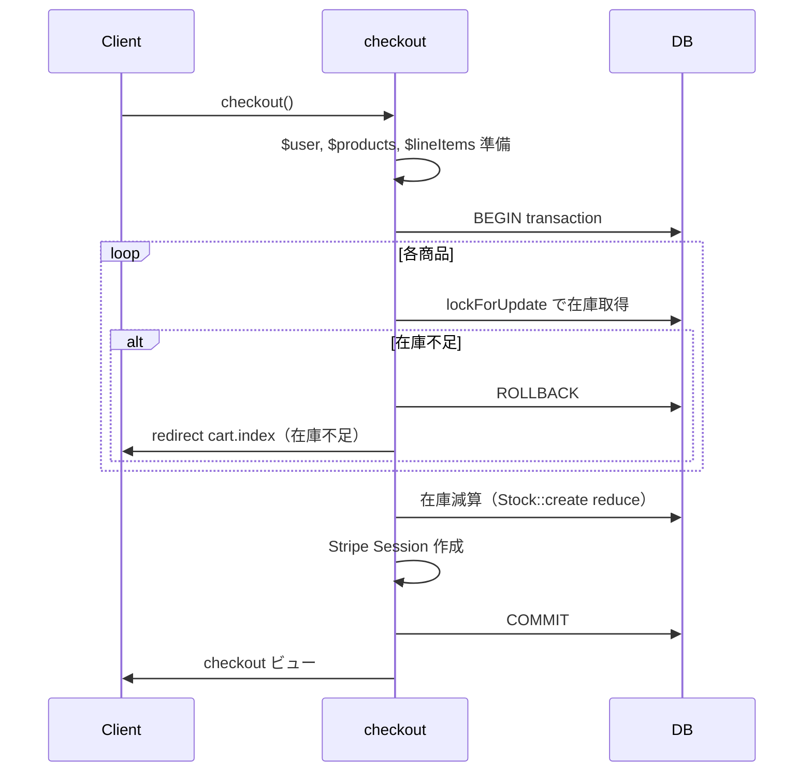

# 課題1：在庫管理の修正と悲観的ロック実装

評価資料「2. 課題ごとの詳細評価」の課題1に対応します。**having 修正・スコープの return 修正は既に完了済み**のため、本プランでは未対応の2点のみを扱います。

---

## 現状の整理

- **完了済み（手を入れない）**
  - [app/Models/Product.php](app/Models/Product.php): `scopeAvailableItems` の `having('quantity', '>', 0)`、`scopeSelectCategory` / `scopeSearchKeyword` の `return $query`、`scopeSortOrder` 末尾の `return $query`
- **未実装**
  1. **悲観的ロック（lockForUpdate）** — [app/Http/Controllers/User/CartController.php](app/Http/Controllers/User/CartController.php) の `checkout()` で在庫チェックがトランザクション外にあり、Race Condition が残っている
  2. **Feature テスト** — 在庫1個表示・在庫不足時リダイレクトの検証が `tests/Feature/` に存在しない

---

## 1. lockForUpdate（悲観的ロック）の実装

### 問題点

- 在庫チェック（85行目付近の `Stock::where(...)->sum('quantity')`）が **トランザクションの外** で実行されている
- その直後の `DB::transaction` 内で在庫減算と Stripe 呼び出しを行っているため、「チェック」と「減算」の間に別リクエストが割り込み、在庫がマイナスになる可能性がある

### 修正方針

- **在庫の取得・チェック・減算**を **同一の `DB::transaction` 内**で行う
- 在庫取得時に `lockForUpdate()` を使い、`SELECT ... FOR UPDATE` で行ロックを取得してからチェック・減算する

### 変更対象

[app/Http/Controllers/User/CartController.php](app/Http/Controllers/User/CartController.php) の `checkout()` メソッド（77〜141行付近）

### 実装イメージ

- **現在**: 在庫チェック（トランザクション外）→ 不足ならリダイレクト → 十分なら `DB::transaction` 内で減算＋Stripe
- **修正後**: `DB::transaction` 内で  
  (1) 全商品について `Stock::where('product_id', $product->id)->lockForUpdate()->sum('quantity')` で取得  
  (2) `$product->pivot->quantity > $quantity` なら `throw new \Exception('在庫不足')`  
  (3) 全件OKなら在庫減算（既存の `Stock::create` で type reduce）  
  (4) 既存どおり Stripe Checkout Session 作成  

- **例外処理**: `catch (\Throwable $e)` で、`$e->getMessage() === '在庫不足'` のときは `redirect()->route('user.cart.index')->with(['message' => '在庫不足です。', 'status' => 'alert'])`、それ以外は既存の「決済の開始に失敗しました」とする

### 注意

- `$lineItems` は在庫数に依存しないため、トランザクションの外で組み立ててよい（現状のまま）
- 課題2では「トランザクション内に Stripe を入れない」方針のため、今回は課題1の範囲として「在庫のロック・チェック・減算をトランザクション内で完結させる」ことに集中する

---

## 2. Feature テストの追加

### 要件（評価資料より）

- **在庫1個の商品が商品一覧に表示される**ことを検証する
- **在庫不足時にチェックアウトでリダイレクトされる**ことを検証する

### 新規ファイル

- `tests/Feature/StockCheckoutTest.php`（または `StockManagementTest.php` など、プロジェクトの命名に合わせる）

### テストケース案

| テストメソッド | 内容 |
|----------------|------|
| `test_product_with_one_stock_appears_in_item_list` | 在庫1個の商品を用意し、認証ユーザーで商品一覧（`ItemController::index` に相当するルート）にアクセスし、その商品が表示されることを assert |
| `test_checkout_redirects_to_cart_index_when_insufficient_stock` | 在庫1個の商品に対し、カートに2個入れた状態で `checkout` に GET し、`cart.index` へリダイレクトされることを assert（在庫不足時の挙動） |

### 実装上のポイント

- `RefreshDatabase` を使用
- 商品一覧: `Product::availableItems()` は `shops` / `secondary_categories` / `images` を JOIN するため、テストで使う Product は **Shop（is_selling=true）、SecondaryCategory、Image** が存在する必要がある（Seeder や Factory の利用、または最小限のレコードをテスト内で作成）
- チェックアウトテスト: **User**（認証）、**Product**、**Stock**（当該商品で quantity=1）、**Cart**（user_id, product_id, quantity=2）を用意し、そのユーザーでログインした上で `GET /cart/checkout`（または `route('cart.checkout')`）を実行し、`redirect(route('user.cart.index'))` または実際のルート名に合わせて assert
- Stripe を実際に叩かないよう、checkout の「在庫不足でリダイレクト」のパスはトランザクション内の `throw` で完了するため、Stripe のモックは不要（在庫不足ケースのみ実装する場合）

### 既存構成の確認

- [tests/Feature/AuthenticationTest.php](tests/Feature/AuthenticationTest.php): `RefreshDatabase` + `User::factory()` を利用
- [database/factories/](database/factories/): ProductFactory / StockFactory / UserFactory あり。Product は shop_id, secondary_category_id, image1〜4 を参照するため、テスト用に Shop / SecondaryCategory / Image のシードまたはファクトリが必要であれば、既存の [database/seeders/DatabaseSeeder.php](database/seeders/DatabaseSeeder.php) を流すか、テスト内で最小データを作成する

---

## 実施順序（推奨）

1. **CartController::checkout() の悲観的ロック対応** — 在庫チェックをトランザクション内に移動し、`lockForUpdate()` と在庫不足時の `Exception` / リダイレクトを実装
2. **Feature テストの追加** — 上記2ケースを `tests/Feature/` に新規作成し、`php artisan test --filter=StockCheckout`（またはファイル名に合わせる）で実行して確認

---

## 補足

- `app\Http\Controllers\User\CartController.php`（バックスラッシュ）は [app/Http/Controllers/User/CartController.php](app/Http/Controllers/User/CartController.php) と実質同一の可能性があるため、修正は **正規のパス側（スラッシュ）の CartController** にのみ行う
- 課題2（Stripe Webhook・トランザクション内API呼び出し）は今回の対象外
